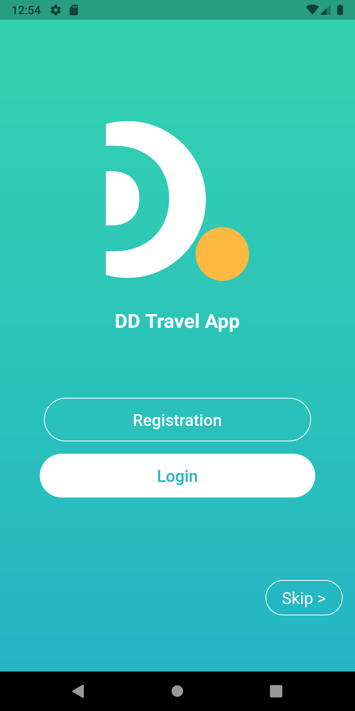
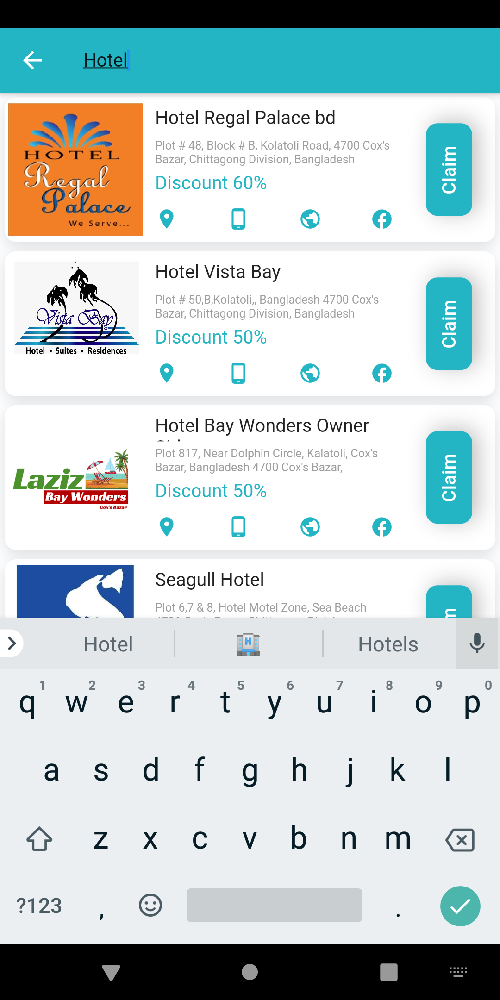
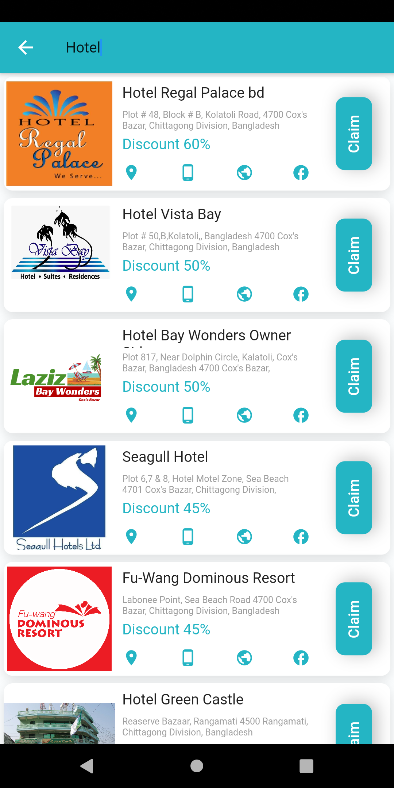
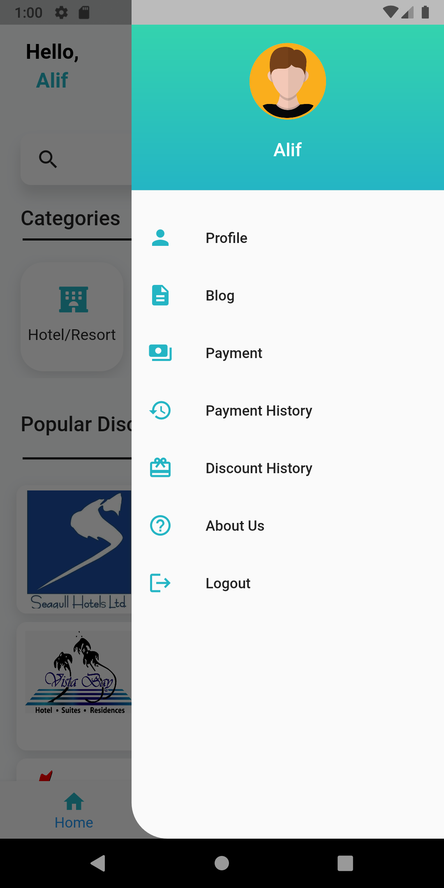

# 🗺️ DD Travel App

**Travel Made Simple.**

Star⭐ the repository if you like the app.

## 📸 ScreenShots

|1 | 2|
|------|-------|
|||

| 3 | 4|
|------|-------|
|||

| 5 | 6|
|------|-------|
|||

| 7 |
|------|
||

## 🌐 Toggle Language
English | Bangla

## ✨ Requirements
* Operating System (MacOS X, Linux, Windows)
* IDE with Flutter SDK installed (Android Studio, VSCode, IntelliJ)

## 📱 App
* Made with Dart and Flutter
* Api Integration (PHP and MySQL)
* Login Register
* Localization
* OTP
* Payment
* CRUD Operation

## 🔥 Developers
**Ahmed Alif**   

**Abir Ahsan Tahmim**   

